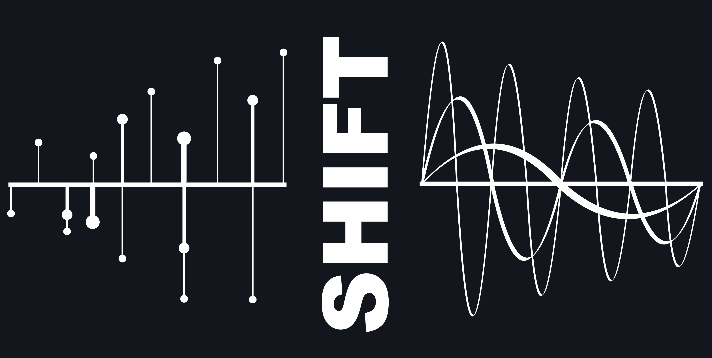

<p align="center">
    <a href="https://github.com/knaidoo29/SHIFT/actions/workflows/tests.yml">
    
    </a>
    <a href="https://codecov.io/gh/knaidoo29/SHIFT" > 
     
    </a>
    <a href="https://img.shields.io/badge/Python-3.9%20|%203.10%20|%203.11%20|%203.12-blue">
    
    </a>
    <a href="https://img.shields.io/github/v/release/knaidoo29/SHIFT">  
    
    </a>
    <a href="https://shift.readthedocs.io/en/latest/">
    
    </a>
    <a href="https://github.com/knaidoo29/SHIFT">
    
    </a>
    <a href="https://opensource.org/licenses/MIT">
    
    </a>
</p>

# SHIFT : Scalable Helper Interface for Fourier Transforms

## Introduction

SHIFT is a scalable interface library for computing FFTs in scipy. The library wraps scipy FFT routines and makes it easy to keep track of corresponding Fourier modes in Fourier space. The package can be scaled using MPI (using the mpi4py library), using a slab decomposition to perform distributed FFTs.

> **NOTE**: SHIFT was originally designed to be a Spherical/Polar Fourier Transform library -- this is the origin of the original acronym SpHerIcal Fourier Transforms. However, the package has developed into being predominanty a helper and MPI interface for FFTs in 1D/2D/3D cartesian grids. The development of the Polar and Spherical Bessel transforms is still ongoing but is no longer the focus -- functions in `shift.polar` and `shift.sphere` should be considered as experimental.

## Dependencies

* `numba`
* `numba-scipy`
* `numpy`
* `scipy`
<!-- * `healpy` -->
* `mpi4py` [Optional: enables MPI parallelism]

## Installation

SHIFT can be installed by cloning the github repository:

```
git clone https://github.com/knaidoo29/SHIFT.git
cd SHIFT
python setup.py build
python setup.py install
```

Once this is done you should be able to call SHIFT from python:


```python
import shift
```

## Documentation

In depth documentation and tutorials are provided [here](https://shift.readthedocs.io/).

## Tutorials

TBA

## Citing

TBA

## Support

If you have any issues with the code or want to suggest ways to improve it please open a new issue ([here](https://github.com/knaidoo29/SHIFT/issues))
or (if you don't have a github account) email _krishna.naidoo.11@ucl.ac.uk_.
