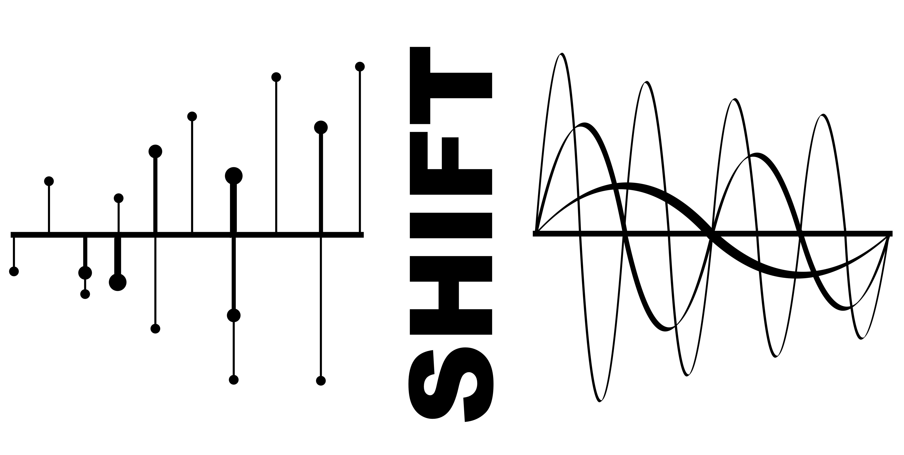

.. raw:: html

   

      
      
      
      
      
      
      
      
      
      
      
      
   

================================================
Scalable Helper Interface for Fourier Transforms
================================================

Introduction
============

SHIFT is a scalable interface library for computing FFTs in scipy. The library wraps scipy 
FFT routines and makes it easy to keep track of corresponding Fourier modes in Fourier 
space. The package can be scaled using MPI (using the `mpi4py` library), using a slab 
decomposition to perform distributed FFTs.

.. note ::

  SHIFT was originally designed to be a Spherical/Polar Fourier Transform library. However, 
  the package has developed into being predominanty a helper and MPI interface for FFTs in 
  1D/2D/3D cartesian grids. The development of the Polar and Spherical Bessel transforms is 
  still ongoing but is no longer the focus -- functions in `shift.polar` and `shift.sphere`
  should be used with extreme caution and are only available from the `sphere` branch of the 
  code.

Contents
========

.. toctree::
   :maxdepth: 2

   cart_index
   mpiutils
   mpi_cart_index
   api

Dependencies
============

* `numba <https://numba.pydata.org/>`_
* `numba-scipy <https://numba-scipy.readthedocs.io/>`_
* `numpy <http://www.numpy.org/>`_
* `scipy <https://scipy.org/>`_
* `mpi4py <https://mpi4py.readthedocs.io/en/stable/>`_ [Optional: enables MPI distributed processes]

Installation
============

SHIFT can be installed via `pip`::

   pip install shift-fft

Or by cloning the github repository::

    git clone https://github.com/knaidoo29/SHIFT.git
    cd SHIFT
    python setup.py build
    python setup.py install

The latter of which can be used to install specific branches.

Once this is done you should be able to call SHIFT from python:

.. code-block:: python

    import shift

To use the MPI functionality please take a look at the documentation which instructs 
users how to use the `SHIFT` `MPI` object and how to run these distributed jobs 
successfully without errors or MPI related hanging.

Citing
======

If you use SHIFT in your work, please cite:

.. image:: https://zenodo.org/badge/DOI/10.5281/zenodo.17093446.svg
   :target: https://doi.org/10.5281/zenodo.17093446

.. code-block:: bibtex

   @software{naidoo_shift_2025,
     author       = {Naidoo, Krishna},
     title        = {SHIFT: a scalable MPI library for computing fast Fourier transforms in python},
     year         = 2025,
     publisher    = {Zenodo},
     doi          = {10.5281/zenodo.17093446},
     url          = {https://doi.org/10.5281/zenodo.17093446}
   }

Support
=======

If you have any issues with the code or want to suggest ways to improve it please
open a new issue (`here <https://github.com/knaidoo29/SHIFT/issues>`_)
or (if you don't have a github account) email krishna.naidoo.11@ucl.ac.uk.