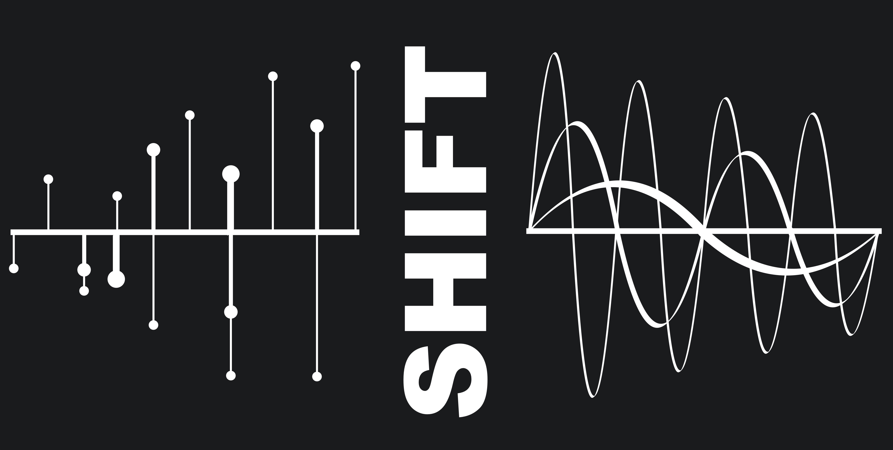

.. image:: _static/SHIFT_logo_large_white.jpg
   :align: center
   :class: only-light

  
================================================
Scalable Helper Interface for Fourier Transforms
================================================

Introduction
============

SHIFT is a scalable interface library for computing FFTs in scipy. The library wraps scipy 
FFT routines and makes it easy to keep track of corresponding Fourier modes in Fourier 
space. The package can be scaled using MPI (using the mpi4py library), using a slab 
decomposition to perform distributed FFTs.

.. note ::

  SHIFT was originally designed to be a Spherical/Polar Fourier Transform library -- this is 
  the origin of the original acronym SpHerIcal Fourier Transforms. However, the package has 
  developed into being predominanty a helper and MPI interface for FFTs in 2D/3D cartesian 
  grids. The development of the Polar and Spherical Bessel transforms is still ongoing but is 
  no longer the focus.

Contents
========

.. toctree::
   :maxdepth: 2

   cart_index
   mpi_index
   spherical_index
   api

Dependencies
============

* `numba <https://numba.pydata.org/>`_
* `numba-scipy <https://numba-scipy.readthedocs.io/>`_
* `numpy <http://www.numpy.org/>`_
* `scipy <https://scipy.org/>`_
* `healpy <https://healpy.readthedocs.io/>`_
* `mpi4py <https://mpi4py.readthedocs.io/en/stable/>`_ [Optional: enables MPI parallelism]

Installation
============

SHIFT can be installed by cloning the github repository::

    git clone https://github.com/knaidoo29/SHIFT.git
    cd SHIFT
    python setup.py build
    python setup.py install

Once this is done you should be able to call SHIFT from python:

.. code-block:: python

    import shift

Support
=======

If you have any issues with the code or want to suggest ways to improve it please
open a new issue (`here <https://github.com/knaidoo29/SHIFT/issues>`_)
or (if you don't have a github account) email krishna.naidoo.11@ucl.ac.uk.